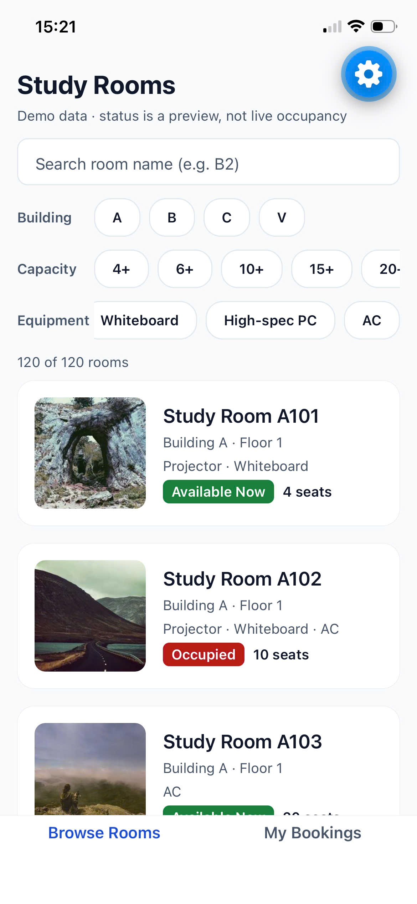
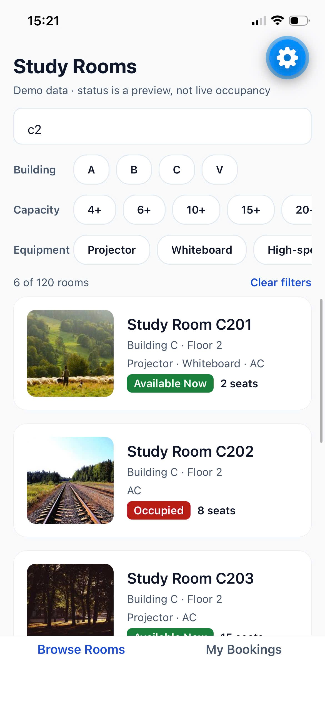
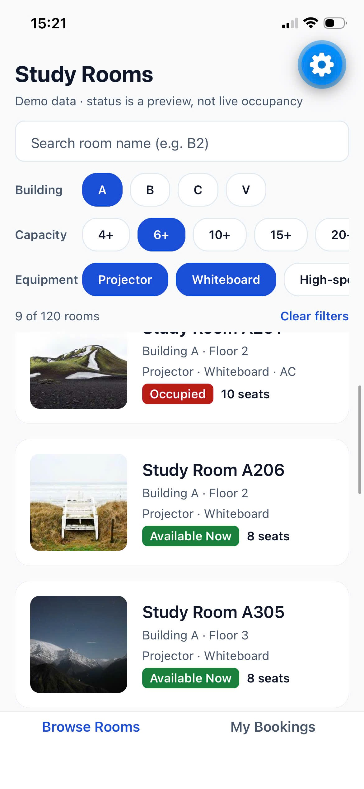
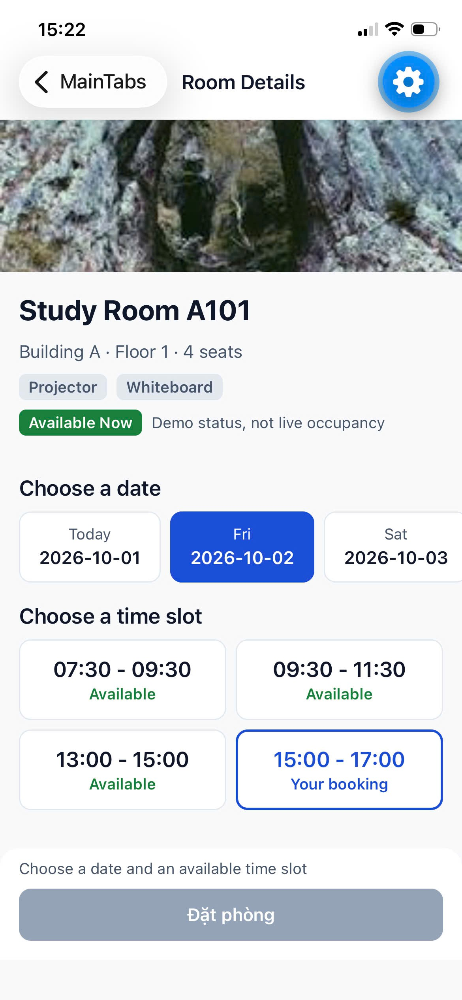
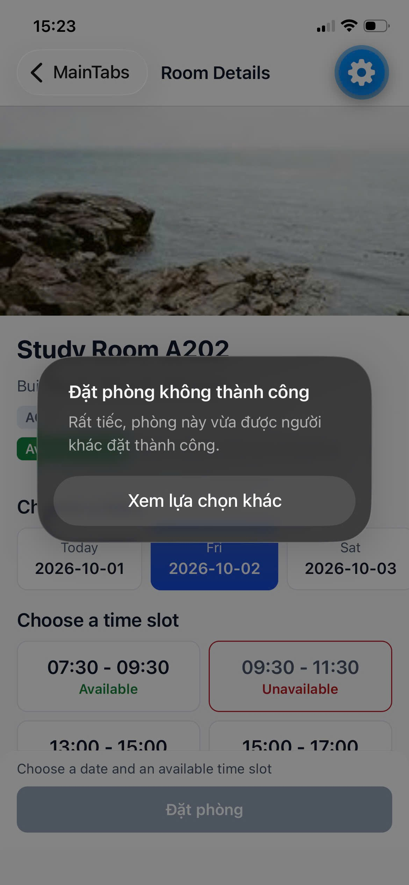
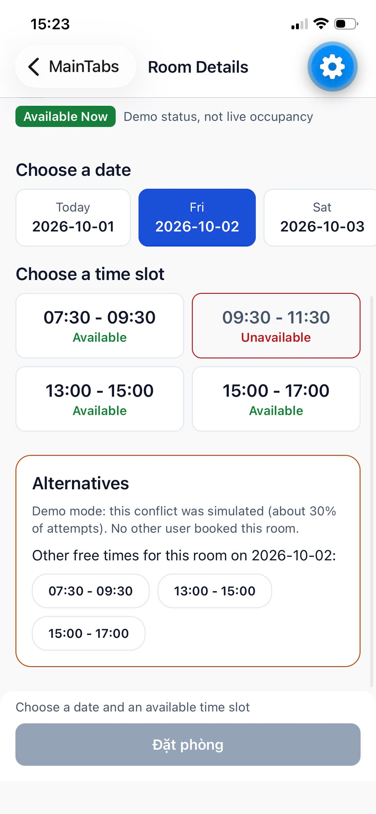
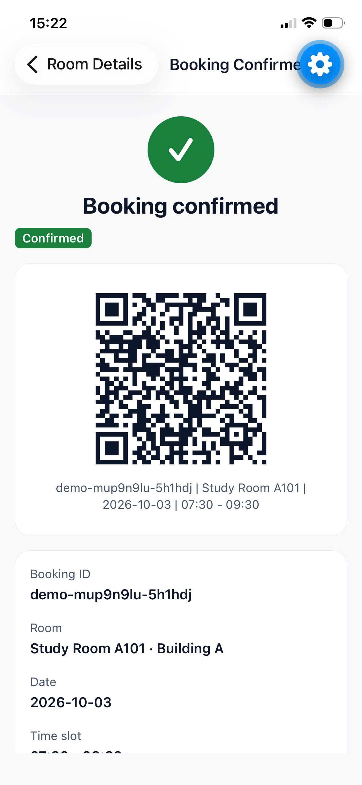
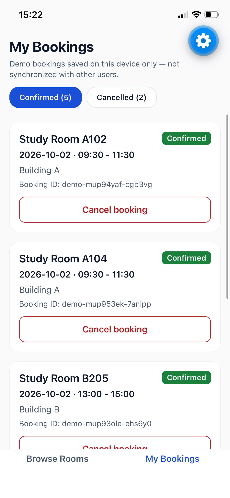
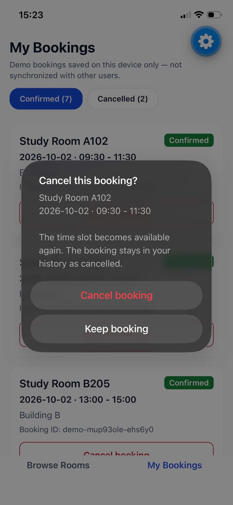
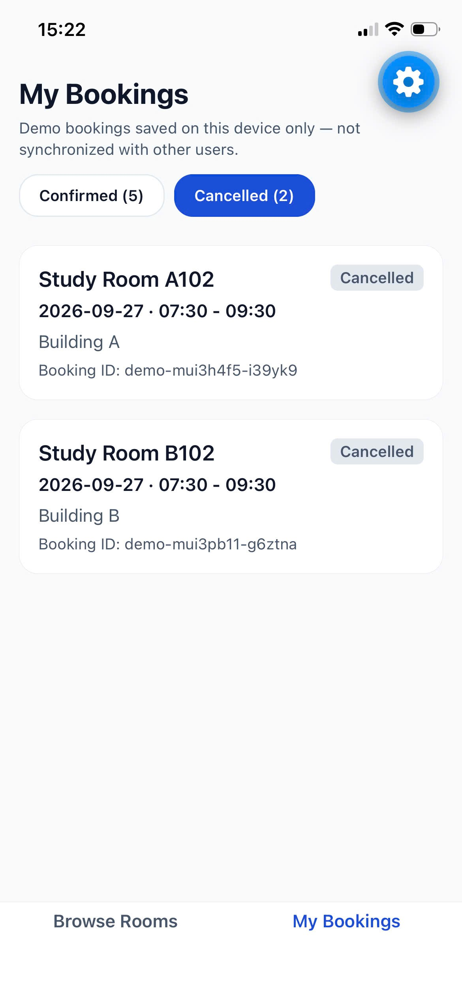

# VKU Study Room Booking

VKU Mini-Project 2. A React Native (Expo) + TypeScript app for VKU students to find a
study room or computer lab and book a `(room, date, time slot)` — with realtime
availability and conflict-free booking across users, on Firebase's free Spark plan.

- GitHub: https://github.com/lddatitvku0202/vku-study-room-booking.git
* Demo:
  * **Web Demo (local MVP):** [Cloudflare Pages](https://vku-study-room-booking-7i4.pages.dev/) — the submitted local-data MVP (mock mode).
  * **Mobile Demo:** runs in **Expo Go** (`npx expo start --tunnel`, then scan the QR code; see [How to run](#how-to-run)). The local MVP was tested on a physical phone in Expo Go on 2026-10-01: PASS.
  * **Android build (firebase mode):** EAS preview APK — see [Mobile build](#mobile-build-eas).
- Video: https://youtu.be/pB-orcaNmTw

## Two data sources

The app runs on one of two data sources, chosen by `DATA_SOURCE` in `.env` (decision AD-37):

| | `mock` (default) | `firebase` |
|---|---|---|
| Rooms | 120 generated rooms, local | 120 rooms in Cloud Firestore |
| Identity | none | Firebase **Anonymous Auth** (one uid per install) |
| Booking | **local conflict simulation** (random ~30% conflicts, labelled in the app) | Firestore **`runTransaction()`** + `slotLocks` — the server decides |
| Availability | this device's bookings | **realtime** `onSnapshot` across all users |
| My Bookings | Zustand + AsyncStorage on the device | Firestore, owner-only, realtime |
| Network | none | Firestore + Auth (Spark plan) |

`mock` is the Emergency Submission MVP exactly as submitted — it is what the Cloudflare web
demo runs (the deployed web demo was not changed; a firebase-mode web build works but has not
been deployed). `firebase` is the production architecture. Production builds use `firebase`; the
local simulator refuses to run in firebase mode.

## Problem

1. **Fast search over 120+ rooms** on a mid-range phone: search and combined filters must
   stay responsive while scrolling a long list.
2. **Booking conflicts:** when several people try to book the same room, date and slot at
   the same moment, **exactly one** may win, and the others need an honest, specific
   message and alternatives.

## Features

- **Browse Rooms:** 120 rooms (buildings A, B, C and V, 30 each; capacity 2–20).
  - Search by room name with a 300 ms debounce.
  - Building, minimum-capacity and equipment filters combined with AND logic, plus Clear filters.
  - "Available Now / Occupied": in firebase mode **derived from today's bookings** (booking-based,
    not sensor occupancy); in mock mode a demo label.
- **Room Details:** the next 7 days and the 4 fixed slots (07:30–09:30, 09:30–11:30,
  13:00–15:00, 15:00–17:00). Slots that have started, your own bookings ("Your booking"),
  other users' bookings ("Booked", realtime) and conflicted slots are disabled.
- **Booking:** "Đặt phòng" shows a spinner and ignores double taps. No optimistic success:
  the confirmation appears only after the booking is committed. On a conflict the alert
  "Đặt phòng không thành công — Rất tiếc, phòng này vừa được người khác đặt thành công."
  appears, the slot is disabled, and other free slots or similar rooms are suggested.
- **Booking pass:** a QR code with `bookingId | roomName | date | slotLabel`, shown only while
  the booking is confirmed (withdrawn when it is cancelled). Display only — no scanner.
- **Reminder:** a local notification 15 minutes before the slot, scheduled only after the
  booking is confirmed; cancelled when the booking is cancelled. Permission is asked only when
  needed; the app keeps working if you refuse.
- **My Bookings:** Confirmed and Cancelled lists. Cancelling (after a confirmation dialog)
  keeps the booking as history and releases the slot for other users immediately.
- **Offline:** browsing keeps working from cached data; booking is disabled until
  availability is confirmed by the server. Nothing is ever queued.

## Demo screenshots

Taken on a physical iPhone in Expo Go on 2026-10-01 with the **local MVP (mock mode)** — the
conflict shown is the labelled local simulation. The blue gear button in the top-right corner
is Expo Go's developer menu, not part of the app.

<table>
  <tr>
    <td align="center"><br><b>1. Browse Rooms</b><br>120 rooms, demo status labels</td>
    <td align="center"><br><b>2. Search</b><br>"c2" → 6 rooms (C201–C206)</td>
    <td align="center"><br><b>3. Combined filters (AND)</b><br>A + 6+ seats + Projector + Whiteboard → 9</td>
  </tr>
  <tr>
    <td align="center"><br><b>4. Room Details</b><br>7-day selector, 4 slots, "Your booking"</td>
    <td align="center"><br><b>5. Simulated conflict</b><br>Required alert; slot becomes Unavailable</td>
    <td align="center"><br><b>6. Alternatives</b><br>Other free times, labelled as a demo conflict</td>
  </tr>
  <tr>
    <td align="center"><br><b>7. Booking confirmed</b><br>QR pass: bookingId | roomName | date | slotLabel</td>
    <td align="center"><br><b>8. My Bookings</b><br>Confirmed list with Cancel buttons</td>
    <td align="center"><br><b>9. Cancel confirmation</b><br>Confirm before cancelling</td>
  </tr>
  <tr>
    <td align="center"><br><b>10. Cancelled history</b><br>Cancelled bookings stay as history</td>
    <td></td>
    <td></td>
  </tr>
</table>

## Architecture (firebase mode)

```
UI (screens, components)
  ↓
hooks (useRooms, useRoomAvailability, useCreateBooking, useMyBookings, useCancelBooking…)
  ↓
services (repository, Firebase backend — the ONLY place Firebase is imported, loaded lazily)
  ↓
Firebase Anonymous Auth · Cloud Firestore · Security Rules     (Spark plan, no Cloud Functions)
```

- **State ownership:** Firestore is the source of truth. TanStack Query holds server state
  (rooms, availability, bookings) — realtime `onSnapshot` payloads are written into its
  cache. Zustand holds client/UI state only (filters, conflict marks, notification ids).
  AsyncStorage persists client state (and mock-mode demo bookings); it never decides
  availability or a booking.
- **Pure domain layer** (`src/types`, `src/data`, `src/utils`): no React, no Firebase —
  slot keys, dates, the booking contract, availability rules, filters.
- **Firebase is lazy:** the SDK is loaded with a dynamic import only in firebase mode, and
  never from `index.ts`; mock mode never evaluates it.

### Booking concurrency (`runTransaction` + `slotLocks`)

```
runTransaction(db, async (tx) => {
  slotKey = roomId_date_slotId                       // e.g. room-B205_2026-10-14_07:30-09:30
  read slotLocks/{slotKey} and bookings/{bookingId}
  lock exists, same bookingId + user → idempotent success (a retry)
  lock exists otherwise                → SLOT_TAKEN
  otherwise → write bookings/{bookingId} AND slotLocks/{slotKey} in the same commit
})
```

Firestore validates the transaction's reads at commit time: if another user commits first,
our transaction is retried with fresh reads and returns `SLOT_TAKEN`. Cancellation is the
mirror image: status `cancelled` and the lock deleted in one commit, so the slot is bookable
by someone else immediately.

### Security Rules (`firestore.rules`)

Deny by default; `if true` appears nowhere; everything requires a signed-in user.
- `rooms`: read-only to clients (written only by the seed script).
- `bookings`: owner-only read; a create must carry the caller's uid, exactly the expected
  fields, one of the four fixed slots, server timestamps, a real room, a slot that has not
  started and lies inside the 7-day window (campus time UTC+07) — and **the same commit
  must create its lock** (`getAfter`). Updates are only the owner's cancellation of a
  future booking, which **must release the lock in the same commit**. Never deleted.
- `slotLocks`: readable by signed-in users (realtime availability); created only together
  with its booking for the caller's uid; **never updated** (cannot be stolen); deleted only
  together with its booking's cancellation by the owner.

## Tech stack

| Area | Library |
|---|---|
| App | Expo SDK 57, React Native 0.86, React 19, TypeScript 6 (strict) |
| Backend | Firebase JS SDK 13: Anonymous Auth, Cloud Firestore, Security Rules (Spark plan) |
| Navigation | React Navigation 7: bottom tabs and native stack, typed params |
| Server state | TanStack Query v5 (room catalogue, realtime availability and bookings) |
| Client state | Zustand v5 with AsyncStorage persistence |
| Dates | date-fns 4 |
| QR | react-native-qrcode-svg + react-native-svg |
| Notifications | expo-notifications (local only, no push) |
| Tests | Vitest, Firebase Emulator Suite, @firebase/rules-unit-testing |

## How to run

Requirements: Node.js 22, npm 10+, the **Expo Go** app on a phone (or a simulator). For the
emulator and the rules tests: the Firebase CLI (`npm i -g firebase-tools`) and **Java 21+**.

```bash
npm install
cp .env.example .env      # required: the app checks this configuration at startup
```

**Mock mode (default — the local MVP):** keep `DATA_SOURCE=mock`.

```bash
npx expo start            # phone and computer on the same Wi-Fi
npx expo start --tunnel   # any network (uses an ngrok tunnel)
```

**Firebase mode (real project):** in `.env` set `DATA_SOURCE=firebase` and the real web
config (`firebase apps:sdkconfig WEB` prints it; it is public by design, but `.env` is never
committed). Then `npx expo start --clear`.

**Firebase mode against the local emulator:** in `.env` set `DATA_SOURCE=firebase`,
`USE_FIREBASE_EMULATOR=true`, `FIREBASE_PROJECT_ID=demo-vku-study-room-booking` (the
emulator only accepts a `demo-` project), and `EMULATOR_HOST` = your computer's LAN IP for a
phone. Then:

```bash
firebase emulators:start --project demo-vku-study-room-booking   # terminal 1
npm run seed:rooms -- --emulator                                  # terminal 2
npx expo start --clear
```

Notes:
- After changing `.env`, always restart with `--clear` (Expo caches the embedded config).
- `--tunnel` needs `@expo/ngrok`. On Windows, if Expo keeps asking to install it, run with
  `NODE_PATH="$(npm root -g)"` (Git Bash) or `$env:NODE_PATH = npm root -g` (PowerShell).

### Setting up a Firebase project from scratch

The project `vku-study-room-booking` is already set up. For a new one (Spark plan, no billing):
1. Create the project and a Firestore database (Native mode); enable **Anonymous** sign-in.
2. Register a Web app (`firebase apps:create WEB …`) and copy its config into `.env`.
3. Put the project id in `.firebaserc`, then deploy rules and indexes **before** the client:
   `firebase deploy --only firestore:rules,firestore:indexes`.
4. Seed the rooms: `npm run seed:rooms -- --production` (uses your own `firebase login`;
   no service-account key is created). Re-running it changes nothing.

## Tests

```bash
npm run typecheck      # app + scripts
npm run lint
npm test               # unit tests (pure logic, hooks' logic) — no network
npm run test:rules     # Auth + Firestore emulators: rules, transactions, realtime, offline, demo
```

`npm run test:rules` needs Java 21+ on PATH. It runs against a `demo-` project id, so it can
never touch the real project.

## Contention demo (70/30)

`npm run demo:contention:emulator` or `npm run demo:contention -- --production`: N separate
anonymous users, ~30% on one hot slot and ~70% on free slots, each waiting 1–1.5 s and then
running the real transaction. The hot slot always has exactly one winner; the split is
measured (e.g. 22/8 = 73.3% / 26.7% for 30 users), never forced. See
[`docs/demo-script.md`](docs/demo-script.md).

## Mobile build (EAS)

`eas.json` has a `preview` profile (internal Android APK) and a `production` profile, both
forced to `DATA_SOURCE=firebase`, `APP_ENV=production` and no emulator. The Firebase web
config comes from EAS environment variables (`eas env:create --environment preview …`), not
from git.

```bash
npx eas-cli build -p android --profile preview      # installable APK
npx eas-cli build -p android --profile production   # store bundle
```

**Status:** the Android **preview APK** was built on EAS (build `64ba3da7-ba6f-4b60-95a0-68b8c79e5f7d`,
from commit `e4673ca`, versionCode 1). Its embedded config is `DATA_SOURCE=firebase`,
`APP_ENV=production`, emulator off, project `vku-study-room-booking`. It was installed and
tested on an Android 13 emulator against the real project (see Verification). A
`production` (store) build has not been run yet. iOS builds additionally need an Apple
Developer account.

## How to use

1. **Browse Rooms:** type in the search box (e.g. `B2`) and tap filter chips. Tap
   **Clear filters** to reset.
2. Tap a room, then pick a **date** and an available **time slot**.
3. Tap **Đặt phòng**:
   - **Success:** the confirmation screen shows the booking, the QR pass and the reminder status.
   - **Conflict:** someone else's booking was committed first (firebase mode) — or, in mock
     mode, the labelled local simulation. The alert appears, the slot is disabled and
     Alternatives lists other free times or similar rooms.
4. **My Bookings:** switch between *Confirmed* and *Cancelled*. Tap **Cancel booking** and
   confirm; the slot becomes available to everyone again.

## Performance strategy

Data flow: rooms → TanStack Query cache → search text → 300 ms debounce → `useMemo(filterRooms)`
→ `FlatList`.

- **Filtering is in memory.** It runs only when the rooms, the debounced search or a
  filter changes, not on every keystroke.
- **The list uses `FlatList`,** with a memoized `RoomCard` (`React.memo`), a fixed row height
  and `getItemLayout`, `initialNumToRender={10}`, `maxToRenderPerBatch={10}`, `windowSize={7}`
  and `removeClippedSubviews`.
- **Realtime is bounded:** one listener for the open room's date, one for today's status of the
  whole list (never one per row), shared between screens and stopped when unused.
- **Selectors:** each component reads only the store fields it needs.

These choices keep the list responsive in testing. **A frame rate is not guaranteed** and was
not measured with a profiler.

## Verification

- **Local MVP (mock mode), physical phone in Expo Go (2026-10-01): PASS** — browsing, search,
  filters, Room Details, booking, the simulated conflict, success + QR, My Bookings,
  cancellation, persistence after a restart, navigation.
- **Firebase mode** (2026-10-08), verified against the real project in a real browser (two
  browser profiles = two users), with separate SDK clients and against the emulator:
  - two users pressing "Đặt phòng" on the same slot at the same moment → exactly one winner;
    the other gets the conflict alert, the disabled slot and alternatives;
  - realtime: one user's booking and cancellation appear on the other user's screen without
    a refresh; a released slot can be booked by the other user;
  - My Bookings shows only your own bookings; the QR pass is withdrawn on cancellation;
  - offline (browser offline mode): booking is disabled with a message, browsing continues;
  - 30-user contention demo on production: 1 winner on the hot slot, 73.3% / 26.7% measured;
  - emulator suites: Security Rules (negative paths first), 20 parallel bookings on one slot →
    exactly 1 success and 19 `SLOT_TAKEN`, cancellation, offline.
- **Firebase mode, production Android APK** (2026-10-08) on an Android 13 emulator against the
  real project, from a fresh install — 21/21: the APK runs in firebase mode; anonymous sign-in;
  120 rooms from Firestore; filter and search; Room Details; another user's booking appears as
  "Booked" on the device without a refresh and its cancellation releases the slot; booking
  through the real transaction (the slot lock exists in production Firestore and belongs to the
  device's anonymous user); QR pass; Android 13 notification permission prompt; reminder
  registered with the system ("Reminder set for 07:15…", alarm present); cancellation releases
  the lock in Firestore and removes the alarm; after a force-stop and relaunch the same
  anonymous user and history are restored, no crash.
- **Not verified:** firebase mode on a physical phone (an emulator was used); notification
  **delivery** (the reminder's alarm is registered and removed, but no reminder was waited
  for); the `production` EAS build; iOS builds.

## Limitations

- **Anonymous identity is per install:** reinstalling or clearing app data starts a new user,
  and that device's earlier bookings are no longer listed (they still exist in Firestore).
- **Reminders are device-local:** a cancellation on one device cannot clear a reminder on
  another. In Expo Go on Android `expo-notifications` cannot load (remote push was removed
  from Expo Go in SDK 53); the app shows "not available" and keeps working — real Android
  reminders need a development or EAS build.
- Realtime listeners are not paused while the app is in the background.
- Similar-room suggestions after a conflict only know the current room's live bookings.
- The server's time checks (past slot, booking window) use campus time, UTC+07; the app's own
  checks use the phone's clock and time zone, so a phone set to another zone may see a booking
  refused by the server.
- The contention demo runs as a script (`npm run demo:contention…`), not as an in-app screen.
- Room images are placeholders from `picsum.photos` and need an internet connection.
- The UI is mostly English, with the Vietnamese texts required by the assignment.

## Documentation

- `docs/progress.md` — what was built, how it was verified, and known issues (MVP and the
  post-MVP Firebase bridge, task by task).
- `PLAN.md` — roadmap (Phase B: the post-MVP Firebase bridge).
- `CLAUDE.md`, `docs/project-brief.md` — architecture rules and decisions.
- `docs/demo-script.md` — the 70/30 contention demo.
